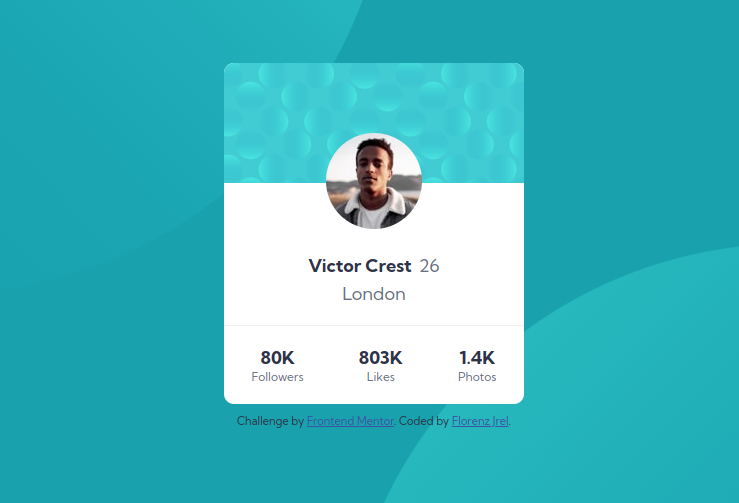

# Frontend Mentor - Profile card component solution

This is a solution to the [Profile card component challenge on Frontend Mentor](https://www.frontendmentor.io/challenges/profile-card-component-cfArpWshJ). Frontend Mentor challenges help you improve your coding skills by building realistic projects. 

## Table of contents

- [Overview](#overview)
  - [The challenge](#the-challenge)
  - [Screenshot](#screenshot)
  - [Links](#links)
- [My process](#my-process)
  - [Built with](#built-with)
  - [What I learned](#what-i-learned)
  - [Useful resources](#useful-resources)
- [Author](#author)

## Overview

### The challenge

- Build out the project to the designs provided

### Screenshot



### Links

- Solution URL: [https://github.com/florenzjrel/profile-card](https://github.com/florenzjrel/profile-card)
- Live Site URL: [https://florenzjrel.github.io/profile-card/](https://florenzjrel.github.io/profile-card/)

## My process

### Built with

- HTML
- CSS

### What I learned

I am a complete beginner and almost lost my marbles with the svg background because it's the first time I've used svg. Finally, after researching I found an article that's about multiple images as background. The first code snippet below was the fruit of my research. I still can't believe you can have multiples images as background. I also encountered a 'good' problem about the border-radius of the blue pattern behind the avatar, it still had its sharp top edges even if I put border-radius in the container, but after fiddling with VS Code I saw a property called 'border-start-end-radius' and instinctively tried it and it worked for my patter!

Some of the code snippets that I'm proud of:

```css
  background-image: url("images/bg-pattern-top.svg"), url("images/bg-pattern-bottom.svg");
  background-size: 900px;
  background-position: left bottom, right top;
  background-position-x: -200px, 650px;
  background-position-y: -550px, 300px;
  background-repeat: no-repeat;
```

```
  border-start-end-radius: 10px;
  border-start-start-radius: 10px;
```

### Useful resources

- [CSS Multiple Backgrounds](https://www.w3schools.com/css/css3_backgrounds.asp) - This is an amazing article which helped me finally understand adding multiple background images. I'd recommend it to anyone still learning this concept.


## Author

- Frontend Mentor - [@florenzjrel](https://www.frontendmentor.io/profile/florenzjrel)
